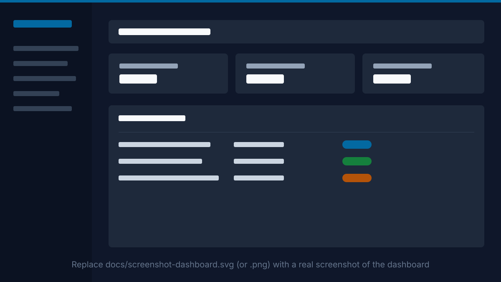
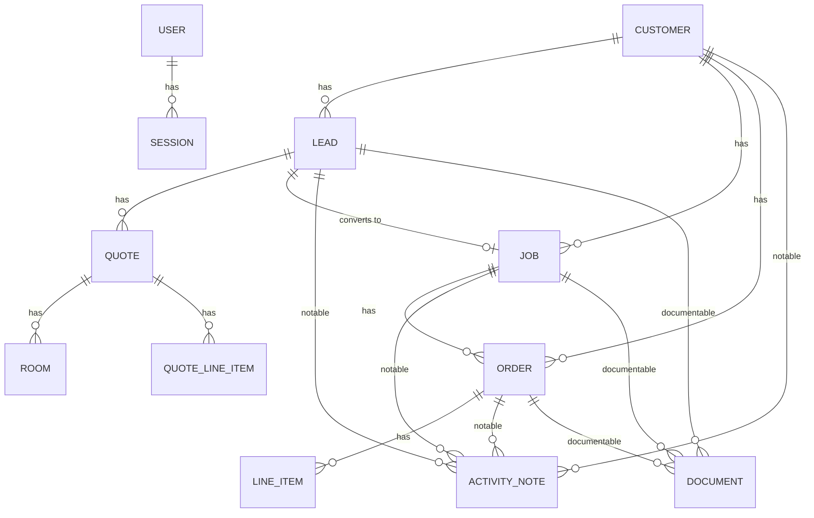

# Jobdeck

A project management app for a small construction business — customers, sales leads, quotes, active jobs, and billing, all in one place. Built to mirror how a flooring/tile installer's business actually runs: a walk-in inquiry becomes a lead, a lead becomes a quote with real room measurements, an accepted quote becomes a job, and a job gets billed through one or more orders.

[](https://github.com/alihadimazeh/jobdeck/actions/workflows/ci.yml)


[](LICENSE)


<!-- Placeholder graphic above — replace docs/screenshot-dashboard.svg with a real
     screenshot or short GIF of the dashboard (same filename works, or update the
     path/extension above if you use a .png/.gif instead). -->

## Table of Contents

- [Why Jobdeck](#why-jobdeck)
- [Features](#features)
- [Domain Model](#domain-model)
- [Tech Stack](#tech-stack)
- [Getting Started](#getting-started)
- [Running Tests](#running-tests)
- [Code Quality & Security](#code-quality--security)
- [Deployment](#deployment)
- [Roadmap](#roadmap)
- [License](#license)

## Why Jobdeck

Most project-management tools are built for software teams. Jobdeck is built around how a construction business actually talks about its work — leads that need following up, quotes with real room-by-room measurements, jobs with a site address that's separate from the customer's billing address, and orders that can lag behind a completed job because payment terms don't line up with the work schedule.

The domain naming reflects that on purpose: a **Job**, not a "Project," because that's what contractors call it. Quotes live on the Lead (pre-commitment); Orders live on the Job (post-commitment) — two models with different lifecycles, kept deliberately separate rather than unified into one generic "estimate."

## Features

- **Full sales pipeline** — Customer → Lead → Quote → Job → Order(s) → Line Items, with status tracking at every stage.
- **Room-based estimation tool** — a Stimulus-powered calculator on the Quote form: enter room dimensions, it sums square footage and auto-populates labor/material line items from rates you enter, fully editable afterward.
- **One-click Lead → Job conversion** — accepting a Quote creates the Job, seeds its first Order from the Quote's line items, and marks the Lead converted, atomically.
- **Activity log & documents** on Customers, Leads, Jobs, and Orders — a running note timeline plus file uploads (PDFs, spreadsheets, photos) via Active Storage, with inline previews for PDFs and images.
- **Search & pagination** (Ransack + Pagy) on the Customer, Lead, and Job indexes.
- **Customer soft-delete** — deleting a customer with billing history archives them instead of failing outright; deleting one with no history removes them for real.
- **Session-based authentication** — sign in/out, "remember me," and password reset by emailed token, all built on Rails 8's own session primitives (no Devise).
- **A real design system**, not scaffold styling — one daisyUI theme, self-hosted fonts, shared partials for every table/form/badge/empty-state in the app, verified for WCAG AA contrast and full keyboard/mobile support.

## Domain Model



A Lead can have several Quotes (a revision, or split scopes like tile vs. flooring), but only one may be `accepted` at a time. `ActivityNote` and `Document` are intentionally separate, polymorphic models — not bolted onto every table — attachable to a Customer, Lead, Job, or Order through one shared pair of partials.

## Tech Stack

| | |
|---|---|
| **Backend** | Ruby 3.4, Rails 8.1, PostgreSQL |
| **Frontend** | Hotwire (Turbo + Stimulus), Tailwind CSS v4, [daisyUI](https://daisyui.com) (vendored, no Node/npm) |
| **Auth** | Rails 8's own `has_secure_password` + session model — no external auth gem |
| **Search / Pagination** | [Ransack](https://github.com/activerecord-hackery/ransack) + [Pagy](https://github.com/ddnexus/pagy) |
| **File uploads** | Active Storage |
| **Background jobs / cache** | Solid Queue, Solid Cache, Solid Cable (database-backed, no Redis) |
| **Testing** | RSpec + FactoryBot + Capybara (system specs), plus the original Minitest suite kept green |
| **CI** | GitHub Actions — Brakeman, bundler-audit, `importmap audit`, RuboCop (Omakase), full test suite |
| **Deployment** | Kamal, deployable as a single Docker container |

## Getting Started

### Prerequisites

- Ruby 3.4.7 (see `.ruby-version` — use whichever version manager you prefer: rbenv, mise, rvm)
- PostgreSQL running locally
- `libvips` (used by Active Storage for image variants):
  ```sh
  # Debian/Ubuntu
  sudo apt-get install libvips
  # macOS
  brew install vips
  ```

No Node/npm is required — Tailwind and daisyUI are both handled without a JS toolchain.

### Installation

```sh
git clone https://github.com/alihadimazeh/jobdeck.git
cd jobdeck
bin/setup
```

`bin/setup` installs gems, prepares the database, and starts the dev server for you. If you'd rather run the steps yourself:

```sh
bundle install
bin/rails db:setup     # creates the database, loads the schema, runs db/seeds.rb
bin/dev                # starts Rails + the Tailwind watcher together
```

Then visit **http://localhost:3000** and sign in with the seeded demo account:

```
email:    admin@jobdeck.test
password: password123
```

The seed data includes a handful of customers, leads at different pipeline stages, and a couple of quotes/jobs/orders, so the app isn't empty on first load.

## Running Tests

```sh
bundle exec rspec        # RSpec suite (models, requests, system specs)
bin/rails test            # the original Minitest suite, kept passing alongside it
```

New coverage always goes in `spec/` (RSpec) — `test/` is legacy and not where new tests are added. System specs need a real browser; see `spec/CLAUDE.md` if `bundle exec rspec` can't find one.

## Code Quality & Security

Every push and pull request runs through GitHub Actions:

- **Brakeman** — static analysis for common Rails vulnerabilities
- **bundler-audit** — known CVEs in gem dependencies
- **`importmap audit`** — known CVEs in JavaScript dependencies (there's no `node_modules` to scan — this app has none)
- **RuboCop** (Rails Omakase style)
- The full RSpec + Minitest suite

## Deployment

Ships as a single Docker image, deployable with [Kamal](https://kamal-deploy.org):

```sh
docker build -t jobdeck .
kamal deploy
```

See the `Dockerfile` for the production image and `config/deploy.yml` for the Kamal configuration.

## Roadmap

Actively developed. Next up:

- **Role-based authorization** (Pundit) — admin / project manager / sales / viewer roles, with per-action policies and role-gated navigation.
- **SSO** — OmniAuth-based Google Workspace, Microsoft Entra ID, and SAML support for partner companies bringing their own identity provider.
- Top-level search/pagination for Quotes and Orders, and a handful of smaller UX items tracked in the project's own backlog.

## License

[MIT](LICENSE)
